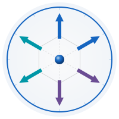

  

# 🏢 Resilience Atlas™ — Enterprise Team Onboarding Guide

**Self-Sufficient · Secure · Hands-Off Authentication via Auth0 Universal Login**

Last updated: 2026-03-24

---

Welcome to **Resilience Atlas**! This guide is designed so that every member of your enterprise team can sign up, log in, and access all features **completely on their own** — no admin approval, no password resets requested from IT, and no barriers between you and your resilience journey.

All authentication is powered by **Auth0 Universal Login**, meaning your access is secure, standards-based, and entirely self-managed.

> 🌐 **Platform URL:** [https://theresilienceatlas.com](https://theresilienceatlas.com)

---

## 🚀 Getting Started — Step-by-Step

### Step 1 — Visit the Platform

Go to [https://theresilienceatlas.com](https://theresilienceatlas.com) in your browser.

### Step 2 — Click "Login" or "Sign Up"

Find the **Login** (or **Sign Up**) button, typically in the top-right corner of the page.

### Step 3 — Authenticate via Auth0

You will be redirected to the **Auth0 Universal Login** screen. Choose your preferred method:

- **Email & Password** — Enter your company or personal email address and create/enter a password.
- **Continue with Google** — Sign in instantly using your Google/Gmail account *(if enabled for your organization)*.
- **Single Sign-On (SSO)** — Use your company's SSO provider *(if configured by your team admin)*.

### Step 4 — Access Your Account

Once authenticated, you are immediately redirected back to Resilience Atlas with full access to:
- The resilience assessment
- Your personal results, history, and growth charts
- Team dashboards and shared resources *(if applicable to your role)*
- All enterprise features assigned to your account

### Step 5 — Explore and Use Resilience Atlas

You're in! Resilience Atlas is designed to empower you — explore your six resilience dimensions, track your growth over time, and connect with your team's shared insights.

---

## 🔑 Password Reset & Account Recovery

Forgot your password? No problem — it's 100% self-service:

1. On the Auth0 login screen, click **"Forgot password?"** (or **"Reset password"**).
2. Enter your email address.
3. Check your inbox for a secure reset link from Auth0.
4. Follow the link to set a new password.

> ✅ **No admin intervention required.** Auth0 handles all password resets automatically and securely.

---

## 🔐 Single Sign-On (SSO)

If your organization uses SSO (e.g., Microsoft Entra ID, Okta, Google Workspace, SAML), your team admin can configure this in the Auth0 dashboard. Once set up:

- Users log in with their existing corporate credentials.
- No separate Resilience Atlas password is needed.
- Access is automatically provisioned based on your organization's directory.

Contact your organization admin or see the [Admin section below](#-for-team-admins--organization-owners) if SSO is not yet configured.

---

## 💼 Teams & Organizations

Resilience Atlas supports **Auth0 Organizations** for enterprise teams, enabling:

- Shared team workspaces
- Role-based access control (member, admin, owner)
- Organization-level dashboards and analytics

### Joining Your Team

- **Via Invite Email:** Your team admin may send you an invitation from Auth0. Click the invite link in your email to join the organization and gain team-level access.
- **Via Self-Registration:** In open-enrollment setups, enter your work email on the login screen. If your domain is configured, you'll be added to the correct org automatically.

---

## 👩‍💻 FAQ

| Question | Answer |
|---|---|
| **How do I log in?** | Visit [theresilienceatlas.com](https://theresilienceatlas.com), click **Login**, and follow the Auth0 prompts. |
| **How do I sign up?** | Same as above — click **Sign Up** and create an account with your email (or use Google/SSO). |
| **How do I reset my password?** | Click **"Forgot password?"** on the Auth0 login screen. A reset email will be sent automatically. |
| **Can I use Google or Microsoft SSO?** | Yes, if enabled by your organization admin. Look for the "Continue with Google" (or SSO) button. |
| **Do I need approval to create an account?** | No — self-registration is enabled. Sign up and you're in immediately. |
| **I'm locked out — what do I do?** | Use "Forgot password?" to recover access. If SSO issues occur, contact your organization's IT admin. |
| **Is my data private?** | Yes. Resilience Atlas is designed with **privacy by design** — no passwords are stored by the platform itself. Auth0 manages all credentials using industry-standard security. |
| **Who can see my assessment results?** | Only you (and your team admin, if your org uses team analytics). Individual results are never shared without your knowledge. |

---

## ⚙️ For Team Admins & Organization Owners

As an organization admin, you can manage team access entirely through the **Auth0 dashboard** — no coding or backend access required.

### Creating a New Organization

1. In the [Auth0 Dashboard](https://manage.auth0.com), go to **Organizations** in the left menu.
2. Click **"Create Organization"**.
3. Set a name, display name, and optional logo for your team.
4. Save and configure membership settings.

### Inviting Team Members

1. Open your Organization in the Auth0 dashboard.
2. Go to the **Members** tab → click **"Invite Members"**.
3. Enter the email addresses of your team members.
4. Assign roles: **Member**, **Admin**, or a custom role.
5. Members will receive an invitation email and can join by clicking the link — no manual provisioning needed.

### Assigning Roles

1. In Auth0, go to **User Management → Roles**.
2. Create roles such as `TeamMember`, `TeamAdmin`, or `TeamOwner`.
3. Assign roles to individual users or to all members of an Organization.
4. Resilience Atlas reads these roles from the Auth0 token to grant appropriate access (dashboards, analytics, admin screens).

### What You Do NOT Need to Do

- ❌ Manually create user accounts
- ❌ Reset user passwords
- ❌ Manage a local user database
- ❌ Approve registrations one by one

> 💡 **Need help with advanced Auth0 configuration (SAML SSO, SCIM provisioning, custom domains)?**
> See the [Auth0 Organizations documentation](https://auth0.com/docs/organizations) or contact our support team.

---

## 🛡️ Privacy & Security by Design

Resilience Atlas is built on the principle that **your data belongs to you**:

- **No passwords stored by Resilience Atlas** — all credentials are managed by Auth0, an industry-leading identity platform.
- **Zero-knowledge architecture** for authentication — we never see your password.
- **Team data is compartmentalized** — individual assessments are not shared across teams without explicit configuration.
- **Auth0 Universal Login** uses HTTPS, PKCE, and other modern security standards by default.
- Users retain full self-service control over their credentials and account recovery at all times.

---

## 📞 Support & Contact

| Need | Action |
|---|---|
| **Login / password issues** | Use Auth0's self-service "Forgot password?" flow |
| **SSO or org configuration** | Contact your organization's IT admin |
| **Platform questions or feature requests** | Reach out to the Resilience Atlas team at [theresilienceatlas.com](https://theresilienceatlas.com) |
| **Enterprise onboarding support** | Contact your designated Resilience Atlas enterprise contact |

---

## 📄 Additional Resources

- [Auth0 Organizations Guide](https://auth0.com/docs/organizations)
- [Auth0 Self-Service Password Reset](https://auth0.com/docs/authenticate/database-connections/password-reset)
- [Resilience Atlas Platform](https://theresilienceatlas.com)

---

This document is maintained by the Resilience Atlas team. For edits or corrections, open a pull request or contact the repository owner. Last updated: 2026-03-24.
